# HTTP File Server Lab

This project contains a minimal HTTP file server and a simple client, both written in Python, plus Docker assets to run everything easily.

## Architecture

```
┌───────────────┐         ┌───────────────┐
│    client     │────────>│    server     │
│   (Python)    │  HTTP   │   (Python)    │
│               │<────────│               │
└───────────────┘         └───────────────┘
        │                           │
        │                           │
        ▼                           ▼
  downloads/                   content/
  (host)                       (host, read-only)
```

Both containers run in the same Docker network and can reach each other by service names (`server`, `client`).

## Lab Deliverables

### Contents of the source directory

```
Laboratory Work 1/
  client/
    client.py
  content/
    Contemporary Literary Fiction/
      Normal People by Sally Rooney.pdf
    Engineering and Autobiographical Non-Fiction/
      Formula 1 Engines.pdf
      How to Build a Car.pdf
    Fantasy and Romance Series/
      Caraval Trilogy/
        Caraval.pdf
      OUABH/
        Once Upon a Broken Heart.pdf
        fox.png
    Gothic Classics/
      Dracul by Bram Stoker.pdf
      ghost.png
    index.html
    hello.html
  downloads/
  server/
    __main__.py  http_server.py  tcp_server.py  request.py  pathing.py  listing.py
  Dockerfile
  docker-compose.yml
  README.md
```

### Docker files

- Dockerfile: `Dockerfile`

```
FROM python:3.11-slim

ENV PYTHONDONTWRITEBYTECODE=1 \
    PYTHONUNBUFFERED=1

WORKDIR /app

COPY server/ /app/server/
COPY client/ /app/client/
COPY content/ /app/content/

EXPOSE 8000

CMD ["python", "-m", "server", "--host", "0.0.0.0", "--port", "8000", "--root", "/app/content"]

```

- Compose: `docker-compose.yml`

```
services:
  server:
    build: .
    container_name: http-server
    command: ["python", "-m", "server", "--host", "0.0.0.0", "--port", "8000", "--root", "/app/content"]
    ports:
      - "8000:8000"
    environment:
      - PYTHONUNBUFFERED=1
    restart: unless-stopped

  client:
    build: .
    container_name: http-client
    depends_on:
      - server
    command: ["python", "client/client.py", "server", "8000", "/", "downloads"]
    volumes:
      - ./downloads:/app/downloads
    environment:
      - PYTHONUNBUFFERED=1

```

### Command that runs the server inside the container (with directory argument)

The container runs this command (see `Dockerfile`):

```bash
python -m server --host 0.0.0.0 --port 8000 --root /app/content
```

### Contents of the served directory

The served root maps to `./content` on the host (mounted to `/app/content`). Example:

```
/
  ├─ Contemporary Literary Fiction/
  ├─ Engineering and Autobiographical Non-Fiction/
  ├─ Fantasy and Romance Series/
  ├─ Gothic Classics/
  ├─ index.html
  └─ hello.html
```

## Let's Jump Right In

### 1) Start the server

```bash
docker compose build
docker compose up -d server
```

Check logs:

```bash
docker compose logs -f server
```

### 2) Access from your browser

- http://localhost:8000/
- http://localhost:8000/index.html
- http://localhost:8000/nope.html (404 example)
- http://localhost:8000/Gothic%20Classics/ghost.png
- http://localhost:8000/Engineering%20and%20Autobiographical%20Non-Fiction/Formula%201%20Engines.pdf

### 3) Use the client (optional)

Run ad-hoc client commands (container exits after each run):

```bash
# HTML (prints body)
docker compose run --rm client python /app/client/client.py server 8000 /index.html /app/downloads

# PNG (saves file)
docker compose run --rm client python /app/client/client.py server 8000 "/Gothic Classics/ghost.png" /app/downloads

# PDF (saves file)
docker compose run --rm client python /app/client/client.py server 8000 "/Engineering and Autobiographical Non-Fiction/Formula 1 Engines.pdf" /app/downloads
```

Saved files are available on the host in `./downloads/`.

#### Run client locally (no Docker)

- Windows (PowerShell):

```powershell
cd "Laboratory Work 1"
python client/client.py ipv4_address 8000 /index.html ./downloads
python client/client.py ipv4_address 8000 "/Gothic Classics/ghost.png" ./downloads
python client/client.py ipv4_address 8000 "/Engineering and Autobiographical Non-Fiction/Formula 1 Engines.pdf" ./downloads
```

### Useful Commands

```bash
# Stop services
docker compose down

# Rebuild after code changes
docker compose up -d --build

# Shells
docker compose exec server bash
docker compose exec client bash

# Clean everything
docker compose down -v
```

### Directory listing (root and a subdirectory)

- Root listing: `http://localhost:8000/`
- Subdirectory listing: `http://localhost:8000/Gothic%20Classics/`

### (Optional) Browsing a friend’s server

1. Find your friend’s IP on the same LAN (e.g., `ipconfig` / `ifconfig` / `ip addr`).
2. Visit: `http://FRIEND_IP:PORT/` in a browser.
3. Or download with the client, e.g.:

```bash
python client/client.py FRIEND_IP PORT "URL_PATH" ./downloads
```

## Screenshots checklist

### 1) Docker status

- Command: `docker compose ps`
- Screenshot: container `server` up
  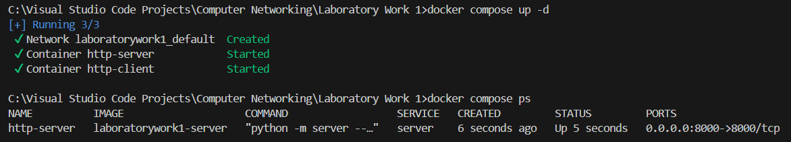

### 2) Server and Client logs

- Command: `docker compose logs -f server`
- Screenshot: server startup line showing host/port
  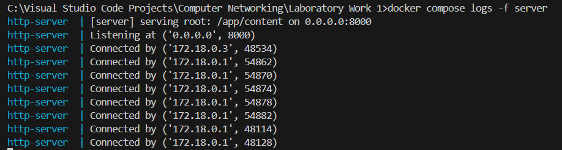
- Client logs (optional):
  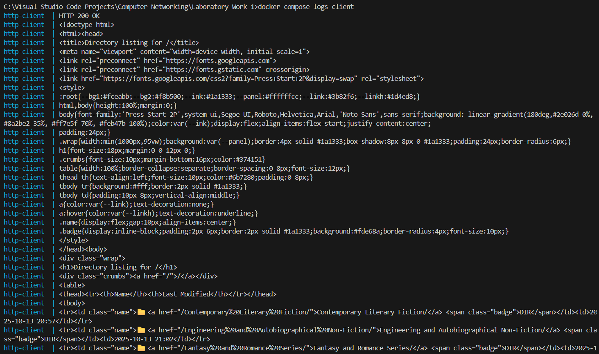

### 3) Browser — 404

- URL: `http://localhost:8000/nope.html`
- Screenshot: 404 page
  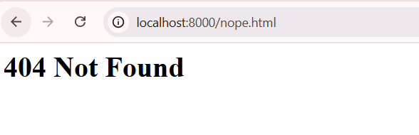

### 4) Browser — HTML with embedded image

- URL: `http://localhost:8000/index.html`
- Screenshot: styled index page with the PNG rendered
  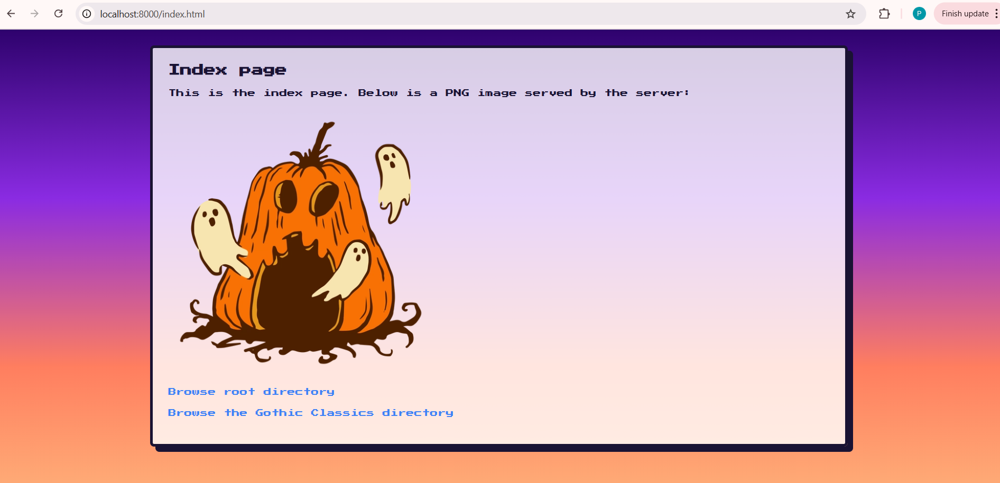

### 5) Browser — PNG file directly

- URL: `http://localhost:8000/Gothic%20Classics/ghost.png`
- Screenshot: image viewer page in the browser
  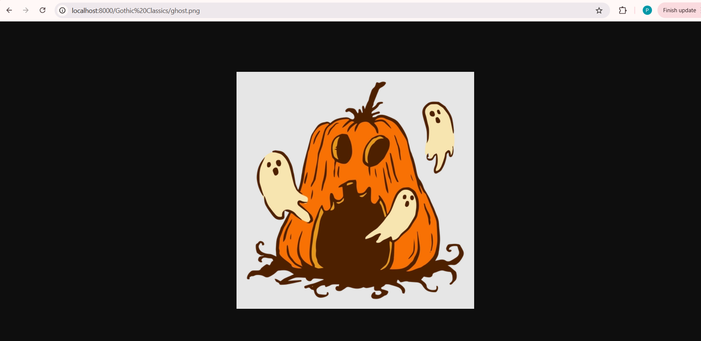

### 6) Browser — PDF file directly

- URL: `http://localhost:8000/Engineering%20and%20Autobiographical%20Non-Fiction/Formula%201%20Engines.pdf`
- Screenshot: PDF viewer in the browser
  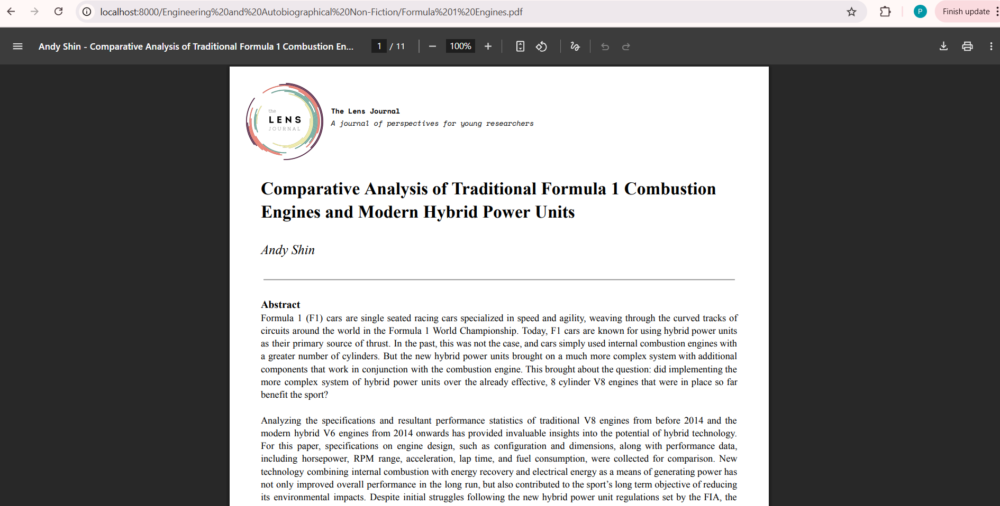

### 7) Directory listing — root

- URL: `http://localhost:8000/`
- Screenshot: generated directory listing page for `/`
  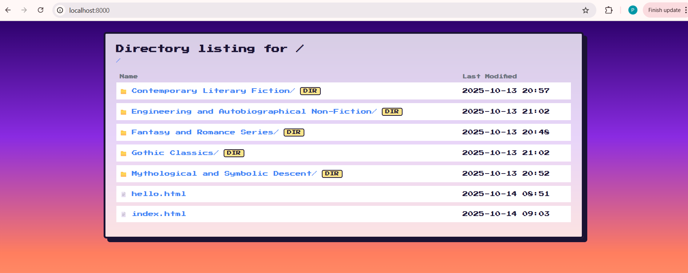

### 8) Directory listing — subdirectory

- URL: `http://localhost:8000/Gothic%20Classics/`
- Screenshot: listing page with breadcrumbs and files
  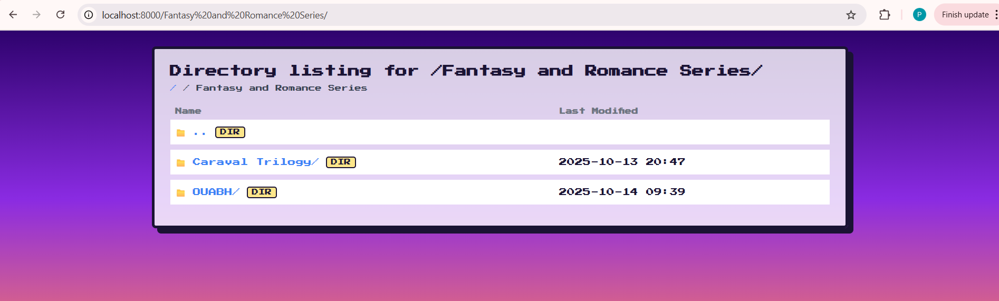
  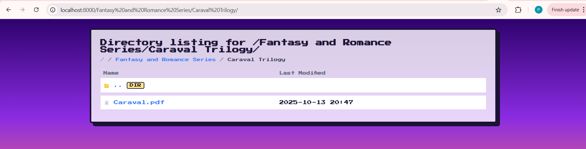

### 9) Client — HTML (prints body)

- Command:
  ```bash
  docker compose run --rm client python /app/client/client.py server 8000 /index.html /app/downloads
  ```
- Screenshot: terminal output showing HTTP status and HTML body
  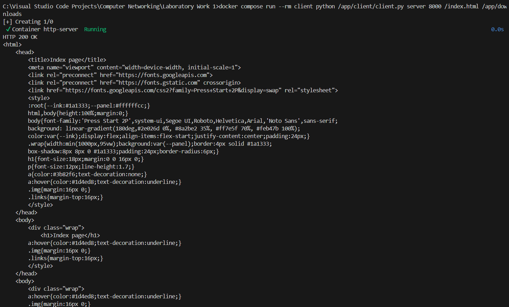
- Full terminal output:

```bash
C:\Visual Studio Code Projects\Computer Networking\Laboratory Work 1>docker compose run --rm client python /app/client/client.py server 8000 /index.html /app/downloads
[+] Creating 1/0
 ✔ Container http-server  Running                                                                                                                           0.0s
HTTP 200 OK
<html>
    <head>
        <title>Index page</title>
        <meta name="viewport" content="width=device-width, initial-scale=1">
        <link rel="preconnect" href="https://fonts.googleapis.com">
        <link rel="preconnect" href="https://fonts.gstatic.com" crossorigin>
        <link href="https://fonts.googleapis.com/css2?family=Press+Start+2P&display=swap" rel="stylesheet">
        <style>
        :root{--ink:#1a1333;--panel:#ffffffcc;}
        html,body{height:100%;margin:0;}
        body{font-family:'Press Start 2P',system-ui,Segoe UI,Roboto,Helvetica,Arial,'Noto Sans',sans-serif;
        background: linear-gradient(180deg,#2e026d 0%, #8a2be2 35%, #ff7e5f 70%, #feb47b 100%);
        color:var(--ink);display:flex;align-items:flex-start;justify-content:center;padding:24px;}
        .wrap{width:min(1000px,95vw);background:var(--panel);border:4px solid #1a1333;
        box-shadow:8px 8px 0 #1a1333;padding:24px;border-radius:6px;}
        h1{font-size:18px;margin:0 0 16px 0;}
        p{font-size:12px;line-height:1.7;}
        a{color:#3b82f6;text-decoration:none;}
        a:hover{color:#1d4ed8;text-decoration:underline;}
        .img{margin:16px 0;}
        .links{margin-top:16px;}
        </style>
    </head>
    <body>
        <div class="wrap">
            <h1>Index page</h1>
        a:hover{color:#1d4ed8;text-decoration:underline;}
        .img{margin:16px 0;}
        .links{margin-top:16px;}
        </style>
    </head>
    <body>
        <div class="wrap">
        a:hover{color:#1d4ed8;text-decoration:underline;}
        .img{margin:16px 0;}
        .links{margin-top:16px;}
        </style>
    </head>
        a:hover{color:#1d4ed8;text-decoration:underline;}
        .img{margin:16px 0;}
        .links{margin-top:16px;}
        a:hover{color:#1d4ed8;text-decoration:underline;}
        a:hover{color:#1d4ed8;text-decoration:underline;}
        .img{margin:16px 0;}
        .links{margin-top:16px;}
        </style>
    </head>
    <body>
        <div class="wrap">
            <h1>Index page</h1>
        a:hover{color:#1d4ed8;text-decoration:underline;}
        .img{margin:16px 0;}
        .links{margin-top:16px;}
        </style>
    </head>
    <body>
        <div class="wrap">
            <h1>Index page</h1>
            <p>This is the index page. Below is a PNG image served by the server:</p>
            <div class="img">
                
        a:hover{color:#1d4ed8;text-decoration:underline;}
        .img{margin:16px 0;}
        .links{margin-top:16px;}
        </style>
    </head>
    <body>
        <div class="wrap">
            <h1>Index page</h1>
            <p>This is the index page. Below is a PNG image served by the server:</p>
        </style>
    </head>
    <body>
        <div class="wrap">
            <h1>Index page</h1>
    <body>
        <div class="wrap">
            <h1>Index page</h1>
            <h1>Index page</h1>
            <p>This is the index page. Below is a PNG image served by the server:</p>
            <div class="img">
                
            <p>This is the index page. Below is a PNG image served by the server:</p>
            <div class="img">
            <p>This is the index page. Below is a PNG image served by the server:</p>
            <div class="img">
                
            </div>
            <div class="links">
                <p><a href="/">Browse root directory</a></p>
                <p><a href="Gothic%20Classics/">Browse the Gothic Classics directory</a></p>
            </div>
            <p>This is the index page. Below is a PNG image served by the server:</p>
            <div class="img">
                
            </div>
            <div class="links">
            <p>This is the index page. Below is a PNG image served by the server:</p>
            <div class="img">
                
            <p>This is the index page. Below is a PNG image served by the server:</p>
            <p>This is the index page. Below is a PNG image served by the server:</p>
            <div class="img">
                
            </div>
            <div class="links">
                <p><a href="/">Browse root directory</a></p>
                <p><a href="Gothic%20Classics/">Browse the Gothic Classics directory</a></p>
            </div>
        </div>
    </body>
</html>
```

### 10) Client — PNG (saves file)

- Command:
  ```bash
  docker compose run --rm client python /app/client/client.py server 8000 "/Gothic Classics/ghost.png" /app/downloads
  ```
- Screenshot: terminal output and a file explorer showing `downloads/ghost.png`
  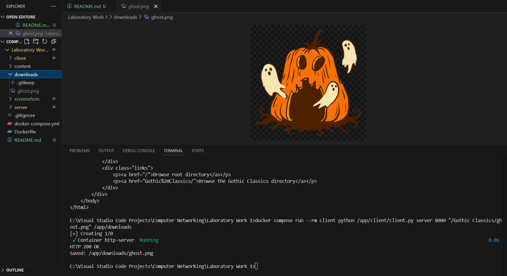
- Temrinal Output:

```bash
C:\Visual Studio Code Projects\Computer Networking\Laboratory Work 1>docker compose run --rm client python /app/client/client.py server 8000 "/Gothic Classics/ghost.png" /app/downloads
[+] Creating 1/0
 ✔ Container http-server  Running                                                                                                                           0.0s
HTTP 200 OK
Saved: /app/downloads/ghost.png
```

### 11) Client — PDF (saves file)

- Command:
  ```bash
  docker compose run --rm client python /app/client/client.py server 8000 "/Engineering and Autobiographical Non-Fiction/Formula 1 Engines.pdf" /app/downloads
  ```
- Screenshot: terminal output showing the saved PDF
  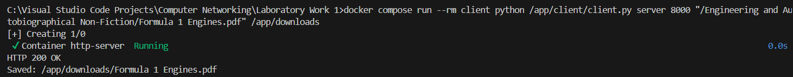

### 12) Friend’s server (well in my case my other laptop)

Steps:

- Network: show `ipconfig`/`ifconfig`
- Browser URL: `http://FRIEND_IP:PORT/`
- Client command:
  ```bash
  python client/client.py FRIEND_IP PORT "URL_PATH" ./downloads
  ```

#### Example (tested over mobile hotspot)

```
Wireless LAN adapter Wi-Fi:

   Connection-specific DNS Suffix  . :
   IPv4 Address. . . . . . . . . . . : 172.20.10.4
   Subnet Mask . . . . . . . . . . . : 255.255.255.240
   Default Gateway . . . . . . . . . : 172.20.10.1
```

Here FRIEND_IP is rather my computer's IP over the mobile hotspot. I downloaded the code on my second laptop with user "Aliona". There I accessed the server that runs on my computer using IPV4:8000. From the computer "Aliona" I ran the client.py.

- From the other laptop, opening `http://172.20.10.4:8000/` worked.
- Screenshots: other laptops’s listing, my client output, saved file in `downloads/`
  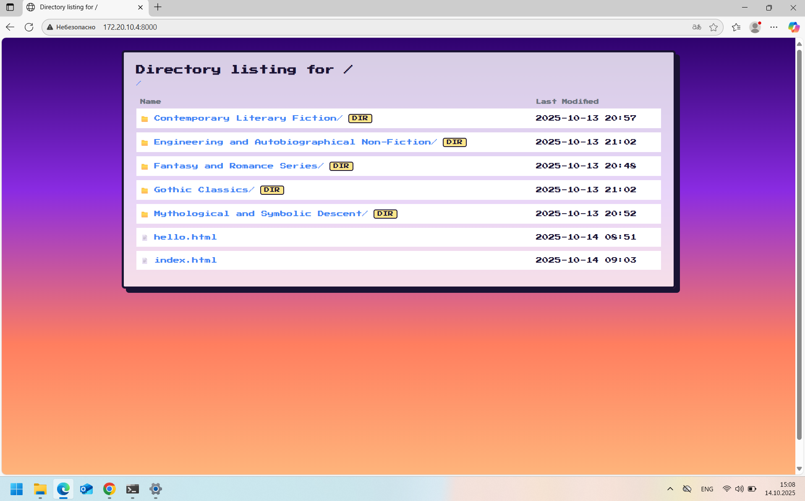
  
  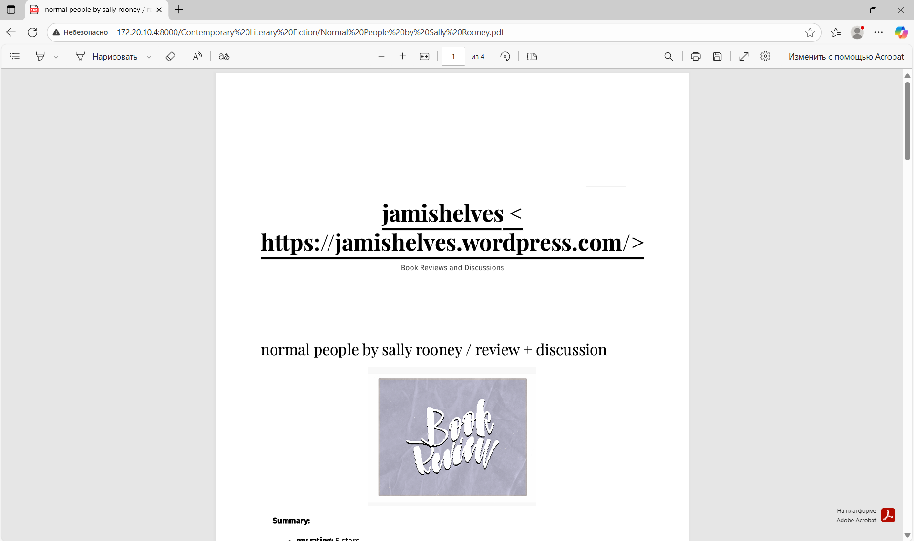
  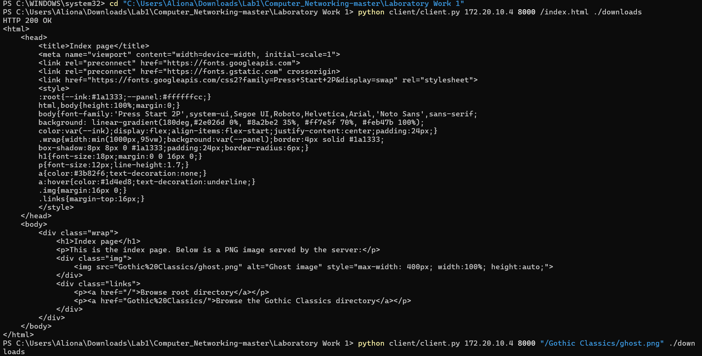
  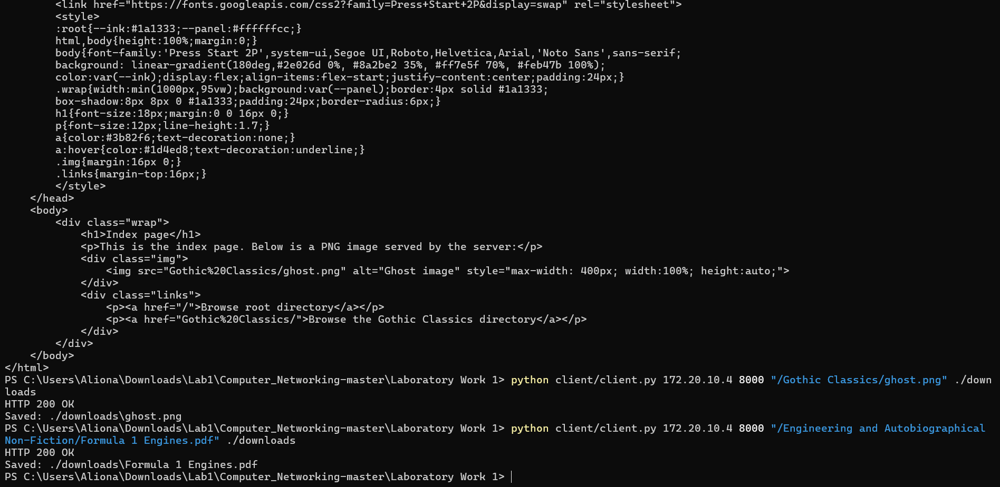

## Conclusion

This lab implements a small but complete HTTP stack: a TCP-based server that safely serves files and directory listings (HTML/PNG/PDF) and a simple client that follows the required argument format and behavior. Docker ensures consistent runs, and the solution was tested locally and across devices via hotspot using the host’s IPv4.
