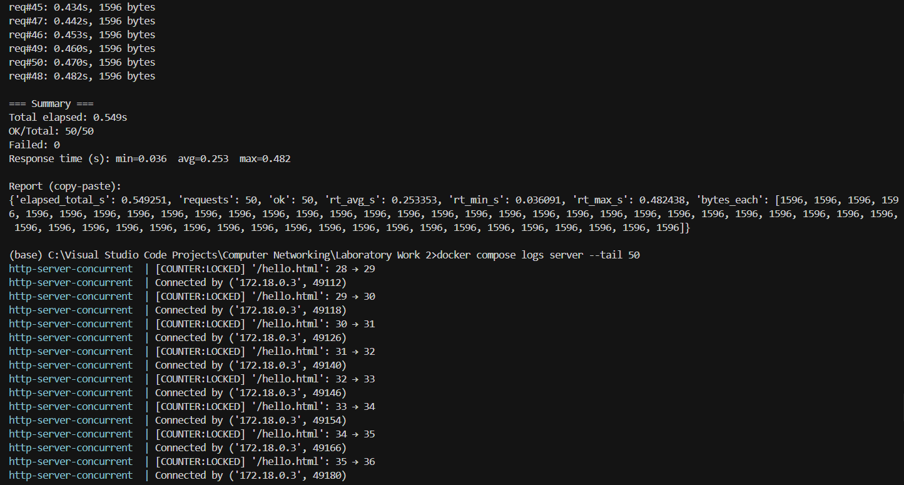

# HTTP File Server Lab

This project contains a minimal HTTP file server and a simple client, both written in Python, plus Docker assets to run everything easily.

## Architecture

```
┌─────────────────────────────────────────────────────────────────────┐
│                    HTTP Server (Concurrent)                         │
│  ┌────────────────────────────────────────────────────────────────┐ │
│  │  ThreadPoolExecutor (max_workers=10)                           │ │
│  │  ┌─────────┐ ┌─────────┐ ┌─────────┐         ┌─────────┐     │ │
│  │  │ Worker  │ │ Worker  │ │ Worker  │   ...   │ Worker  │     │ │
│  │  │ Thread  │ │ Thread  │ │ Thread  │         │ Thread  │     │ │
│  │  └─────────┘ └─────────┘ └─────────┘         └─────────┘     │ │
│  └────────────────────────────────────────────────────────────────┘ │
│                                                                      │
│  Shared State (Thread-Safe):                                        │
│  • Hit Counter (naive/locked mode) - tracks requests per path       │
│  • Rate Limiter (per-IP) - sliding window algorithm                 │
│                                                                      │
│  Features:                                                           │
│  • Directory listing with hit counts                                │
│  • File serving (.html, .pdf, .png)                                 │
│  • Rate limiting (5 req/s per IP)                                   │
│  • 429 Too Many Requests response                                   │
└─────────────────────────────────────────────────────────────────────┘
                              ▲
                              │ HTTP
                              │
        ┌─────────────────────┼─────────────────────┐
        │                     │                     │
┌───────▼─────────┐  ┌────────▼────────┐  ┌────────▼────────┐
│  client.py      │  │  bench.py       │  │rate_limit_test  │
│  (single req)   │  │  (concurrent)   │  │(spammer test)   │
└─────────────────┘  └─────────────────┘  └─────────────────┘
        │                     │                     │
        ▼                     ▼                     ▼
  downloads/            benchmarks           rate limit demo
```

All containers run in the same Docker network and communicate via service names.

## Lab Deliverables

### Contents of the source directory

```
Laboratory Work 2/
  client/
    client.py              # Simple HTTP client for file downloads
    bench.py               # Concurrent benchmark tool (measures throughput)
    rate_limit_test.py     # Rate limiting test (spammer vs normal user)
  content/
    Contemporary Literary Fiction/
      Normal People by Sally Rooney.pdf
    Engineering and Autobiographical Non-Fiction/
      Formula 1 Engines.pdf
      How to Build a Car.pdf
    Fantasy and Romance Series/
      Caraval Trilogy/
        Caraval.pdf
      OUABH/
        Once Upon a Broken Heart.pdf
        fox.png
    Gothic Classics/
      Dracul by Bram Stoker.pdf
      ghost.png
    index.html
    hello.html
    Mythological and Symbolic Descent/
      Katabasis by RF Kuang.pdf
  downloads/
  screenshots/
    single_thread.png      # Single-threaded benchmark results
    multithread.png        # Multi-threaded benchmark results
    naive1-6.png          # Race condition demonstration (naive mode)
    naive7.png            # Browser showing data loss (11/50 hits)
    lock1-4.png           # Race condition fix (locked mode)
    lock5.png             # Browser showing correct count (50/50 hits)
    rate1-6.png           # Rate limiting test results
    429browser.png        # 429 Too Many Requests response
  server/
    __init__.py           # Package initialization
    __main__.py           # Entry point with argument parsing
    http_server.py        # HTTP server with hit counter & rate limiter
    tcp_server.py         # TCP server with thread pool
    request.py            # HTTP request parser
    response.py           # (empty - methods in http_server.py)
    pathing.py            # Safe path resolution
    listing.py            # Directory listing HTML generator
  Dockerfile              # Container build configuration
  docker-compose.yml      # Multi-container orchestration
  README.md               # This file
```

**Server Modules:**
- `tcp_server.py` - Bounded thread pool (configurable workers), semaphore-based backpressure
- `http_server.py` - Hit counter (naive/locked modes), rate limiter (per-IP), request routing
- `request.py` - Parses HTTP request line (method, URI, version)
- `listing.py` - Generates styled directory listings with hit counts and breadcrumbs
- `pathing.py` - Prevents path traversal attacks, validates file access

**Client Tools:**
- `client.py` - Basic HTTP client for testing individual requests
- `bench.py` - Concurrent load testing with timing statistics
- `rate_limit_test.py` - Demonstrates rate limiting effectiveness

### Command that runs the server inside the container

The container runs this command (see `Dockerfile`):

```bash
python -m server --host 0.0.0.0 --port 8000 --root /app/content \
  --workers ${WORKERS} --delay ${DELAY} \
  --counter-mode ${COUNTER_MODE} --counter-delay ${COUNTER_DELAY} \
  --rate-limit ${RATE_LIMIT}
```

**Parameters:**
- `--host` - Bind address (0.0.0.0 for Docker)
- `--port` - Port number (default: 8000)
- `--root` - Content directory to serve
- `--workers` - Max concurrent worker threads (default: 10)
- `--delay` - Simulated work delay per request in seconds (default: 0.0)
- `--counter-mode` - Hit counter: `naive` (race condition) or `locked` (thread-safe)
- `--counter-delay` - Extra delay during counter increment to force races (default: 0.0)
- `--rate-limit` - Rate limit per IP in requests/second, 0 = disabled (default: 0.0)

**Environment Variables:**
Set these before running `docker compose up` to configure the server:
```bat
set WORKERS=10
set DELAY=1.0
set COUNTER_MODE=locked
set COUNTER_DELAY=0.0
set RATE_LIMIT=5
```

## Lab 2 — Multithreaded Server and Benchmark (Concurrency)

### What changed in Lab 2
- The TCP server now uses a bounded thread pool to handle requests concurrently.
- Runtime flags control concurrency and simulated work delay:
  - `--workers N` — max in-flight connections handled concurrently.
  - `--delay S` — optional per-request delay to simulate ~S seconds of work.
- A benchmark script (`client/bench.py`) issues concurrent GETs and prints a detailed report.

### Dockerfile (Lab 2)
Environment variables drive the server configuration at runtime.

```startLine:endLine:Laboratory Work 2/Dockerfile
FROM python:3.11-slim

ENV PYTHONDONTWRITEBYTECODE=1 \
    PYTHONUNBUFFERED=1 \
    WORKERS=10 \
    DELAY=0.0 \
    COUNTER_MODE=naive \
    COUNTER_DELAY=0.0

WORKDIR /app

COPY server/ /app/server/
COPY client/ /app/client/
COPY content/ /app/content/

EXPOSE 8000

CMD ["sh", "-c", "python -m server --host 0.0.0.0 --port 8000 --root /app/content --workers ${WORKERS} --delay ${DELAY} --counter-mode ${COUNTER_MODE} --counter-delay ${COUNTER_DELAY}"]
```

### docker-compose (Lab 2)
- Exposes `server` and a `bench` utility service. The optional `client` service is commented out.

```startLine:endLine:Laboratory Work 2/docker-compose.yml
services:
  server:
    build: .
    container_name: http-server-concurrent
    ports:
      - "8000:8000"
    environment:
      - PYTHONUNBUFFERED=1
      - WORKERS=${WORKERS:-10}
      - DELAY=${DELAY:-0.0}
      - COUNTER_MODE=${COUNTER_MODE:-naive}
      - COUNTER_DELAY=${COUNTER_DELAY:-0.0}
    restart: unless-stopped

  bench:
    build: .
    container_name: http-bench
    depends_on:
      - server
    command: ["python","client/bench.py"]
    environment:
      - PYTHONUNBUFFERED=1
      - BENCH_HOST=server
      - BENCH_PORT=8000
      - BENCH_PATH=/index.html
      - BENCH_CONCURRENCY=10
```

Note: When running `docker compose run bench ...EXTRA_ARGS...`, the extra args replace the configured command. To pass flags reliably, invoke the script explicitly as shown below.

### Multithreading quick test
PowerShell:
```powershell
cd "Laboratory Work 2"
set WORKERS = "10" && set DELAY = "1.0"
docker compose up -d --build server
docker compose run --rm bench python client/bench.py --host server --port 8000 --path /index.html --concurrency 10 --timeout 20

set WORKERS = "1" && set DELAY = "1.0"
docker compose up -d --force-recreate server
docker compose run --rm bench python client/bench.py --host server --port 8000 --path /index.html --concurrency 10 --timeout 20
```

Command Prompt (cmd.exe):
```bat
cd "Laboratory Work 2"
set WORKERS=10
set DELAY=1.0
docker compose up -d --build server
docker compose run --rm bench python client/bench.py --host server --port 8000 --path /index.html --concurrency 10 --timeout 20

set WORKERS=1
set DELAY=1.0
docker compose up -d --force-recreate server
docker compose run --rm bench python client/bench.py --host server --port 8000 --path /index.html --concurrency 10 --timeout 20
```

Expected outcome with `DELAY=1.0`:
- `WORKERS=10`: total ≈ 1–2s for 10 requests (parallel).
- `WORKERS=1`: total ≈ 10–12s for 10 requests (sequential).

### Benchmark script output
The script prints a distinct report format, e.g.:

```text
=== HTTP Concurrency Bench ===
Host: server    Port: 8000
URL: /index.html     Concurrency: 10
Running requests...
req#1: 1.041s, 2027 bytes
...

=== Summary ===
Total elapsed: 1.052s
OK/Total: 10/10
Failed: 0
Response time (s): min=1.033  avg=1.040  max=1.045

Report (copy-paste): { ... }
```

### Multithreading Performance Results

**Single-threaded (workers=1, delay=1.0s):**


10 concurrent requests handled sequentially: ~10 seconds total

---

**Multi-threaded (workers=10, delay=1.0s):**


10 concurrent requests handled in parallel: ~1-2 seconds total

---

The multi-threaded server demonstrates significant performance improvement when handling concurrent requests with simulated work delays.

## Race Condition Demonstration

This section demonstrates a classic race condition in concurrent programming and how to fix it using synchronization mechanisms.

### Overview

The server includes a **hit counter** that tracks how many times each path (file or directory) is requested. This counter is shared across all worker threads, creating a potential race condition when multiple threads try to increment the same counter simultaneously.

**The Problem:** In naive mode, the counter uses a simple read-modify-write pattern without synchronization:
```python
# Thread-unsafe (naive mode)
previous = self.hits.get(key, 0)  # READ
self.hits[key] = previous + 1     # WRITE (race window!)
```

When multiple threads execute this code concurrently on the same key, they can read the same `previous` value, then all write `previous + 1`, causing **lost updates**.

**The Solution:** Use a lock to ensure atomic read-modify-write operations:
```python
# Thread-safe (locked mode)
with self._hits_lock:
    previous = self.hits.get(key, 0)
    self.hits[key] = previous + 1
```

---

### Test 1: Naive Mode (Demonstrating the Race Condition)

**Configuration:**
- `COUNTER_MODE=naive` — No synchronization
- `COUNTER_DELAY=0.01` — Artificial delay to increase the probability of thread interleaving
- 50 concurrent requests to the same path

**Commands:**
```bat
cd "Laboratory Work 2"
set COUNTER_MODE=naive
set COUNTER_DELAY=0.01
set WORKERS=10
set DELAY=0.0
docker compose up -d --build server
```

Wait for the server to start, then run the benchmark:
```bat
docker compose run --rm bench python client/bench.py --host server --port 8000 --path /index.html --concurrency 50 --timeout 30
```

To view statistics, visit `http://localhost:8000/_stats` in your browser, then check the logs:
```bat
docker compose logs server --tail 50
```

**Results:**

Server logs showing concurrent updates with race condition:
```
http-server-concurrent  | 
http-server-concurrent  | [COUNTER:NAIVE]  '/index.html': 6 → 7 (⚠️ race possible)[COUNTER:NAIVE]  '/index.html': 7 → 8 (⚠️ ️ race possible)
http-server-concurrent  | Connected by
http-server-concurrent  | [COUNTER:NAIVE]  '/index.html': 7 → 8 (⚠️ race possible)[COUNTER:NAIVE]  '/index.html': 6 → 7 (⚠️ ️ race possible)
http-server-concurrent  |  ('172.18.0.3', 49078)
http-server-concurrent  | [COUNTER:NAIVE]  '/index.html': 7 → 8 (⚠️ race possible)
http-server-concurrent  | Connected by
http-server-concurrent  | [COUNTER:NAIVE]  '/index.html': 7 → 8 (⚠️ race possible)
http-server-concurrent  |  ('172.18.0.3', 49092)
http-server-concurrent  | Connected by[COUNTER:NAIVE]  '/index.html': 7 → 8 (⚠️ race possible)
http-server-concurrent  |  ('172.18.0.3', 49108)
http-server-concurrent  | Connected by[COUNTER:NAIVE]  '/index.html': 8 → 9 (⚠️ race possible) ('172.18.0.3', 49118)       
http-server-concurrent  | Connected by
http-server-concurrent  |  ('172.18.0.3', 49132)
http-server-concurrent  | Connected by ('172.18.0.3', 49142)
http-server-concurrent  | Connected by ('172.18.0.3', 49146)
http-server-concurrent  | Connected by ('172.18.0.3', 49126)
http-server-concurrent  | [COUNTER:NAIVE]  '/index.html': 8 → 9 (⚠️ race possible)[COUNTER:NAIVE]  '/index.html': 8 → 9 (⚠️ ️ race possible)[COUNTER:NAIVE]  '/index.html': 9 → 10 (⚠️ race possible)
http-server-concurrent  | Connected by ('172.18.0.3', 49154)
http-server-concurrent  |
http-server-concurrent  |
http-server-concurrent  | [COUNTER:NAIVE]  '/index.html': 9 → 10 (⚠️ race possible)
http-server-concurrent  | [COUNTER:NAIVE]  '/index.html': 9 → 10 (⚠️ race possible)
http-server-concurrent  | [COUNTER:NAIVE]  '/index.html': 9 → 10 (⚠️ race possible)
http-server-concurrent  | Connected by ('172.18.0.3', 49164)
http-server-concurrent  | Connected by ('172.18.0.3', 49168)
http-server-concurrent  | Connected by ('172.18.0.3', 49170)
http-server-concurrent  | [COUNTER:NAIVE]  '/index.html': 9 → 10 (⚠️ race possible)
http-server-concurrent  | [COUNTER:NAIVE]  '/index.html': 10 → 11 (⚠️ race possible)
http-server-concurrent  | [COUNTER:NAIVE]  '/index.html': 10 → 11 (⚠️ race possible)
http-server-concurrent  | [COUNTER:NAIVE]  '/index.html': 10 → 11 (⚠️ race possible)
http-server-concurrent  | [COUNTER:NAIVE]  '/index.html': 10 → 11 (⚠️ race possible)
http-server-concurrent  | Connected by ('172.18.0.1', 46938)
http-server-concurrent  |
http-server-concurrent  | ================================================================================
http-server-concurrent  | HIT COUNTER STATISTICS
http-server-concurrent  | ================================================================================
http-server-concurrent  | Mode              : NAIVE
http-server-concurrent  | Total Requests    : 50
http-server-concurrent  | [COUNTER:NAIVE]  '/index.html': 9 → 10 (⚠️ race possible)
http-server-concurrent  | [COUNTER:NAIVE]  '/index.html': 9 → 10 (⚠️ race possible)
http-server-concurrent  | [COUNTER:NAIVE]  '/index.html': 9 → 10 (⚠️ race possible)
http-server-concurrent  | Connected by ('172.18.0.3', 49164)
http-server-concurrent  | Connected by ('172.18.0.3', 49168)
http-server-concurrent  | Connected by ('172.18.0.3', 49170)
http-server-concurrent  | [COUNTER:NAIVE]  '/index.html': 9 → 10 (⚠️ race possible)
http-server-concurrent  | [COUNTER:NAIVE]  '/index.html': 10 → 11 (⚠️ race possible)
http-server-concurrent  | [COUNTER:NAIVE]  '/index.html': 10 → 11 (⚠️ race possible)
http-server-concurrent  | [COUNTER:NAIVE]  '/index.html': 10 → 11 (⚠️ race possible)
http-server-concurrent  | [COUNTER:NAIVE]  '/index.html': 10 → 11 (⚠️ race possible)
http-server-concurrent  | Connected by ('172.18.0.1', 46938)
```
Statistics report:
```
http-server-concurrent  | ================================================================================
http-server-concurrent  | HIT COUNTER STATISTICS
http-server-concurrent  | ================================================================================
http-server-concurrent  | Mode              : NAIVE
http-server-concurrent  | Total Requests    : 50
http-server-concurrent  | Unique Paths      : 1
http-server-concurrent  | Total Recorded Hits: 11
http-server-concurrent  | Lost Updates      : 39 (78.0%)
http-server-concurrent  |                     ⚠️  SIGNIFICANT DATA LOSS - Race condition detected!
http-server-concurrent  | --------------------------------------------------------------------------------
http-server-concurrent  | Top 5 paths by hits:
http-server-concurrent  |     11 hits: /index.html
http-server-concurrent  | ================================================================================
http-server-concurrent  |
http-server-concurrent  | Connected by ('172.18.0.1', 46952)
http-server-concurrent  | Connected by ('172.18.0.1', 46956)
```

**Analysis:**
- **Expected:** 50 requests → 50 hits
- **Actual:** 50 requests → 11 hits
- **Lost Updates:** 39 (78% data loss!)
- **Evidence:** Multiple threads reading the same value simultaneously (e.g., four threads all read `9` and write `10`)

**Screenshots:**

<table>
<tr>
<td width="50%">


</td>
<td width="50%">


</td>
</tr>
<tr>
<td width="50%">


</td>
<td width="50%">


</td>
</tr>
<tr>
<td width="50%">


</td>
<td width="50%">


</td>
</tr>
<tr>
<td colspan="2" align="center">

**🔴 Browser View: Only 11 hits recorded out of 50 requests (78% data loss)**


</td>
</tr>
</table>

---

### Test 2: Locked Mode (Fixing the Race Condition)

**Configuration:**
- `COUNTER_MODE=locked` — Thread-safe with locks
- `COUNTER_DELAY=0.01` — Same delay to show locks prevent races even under pressure
- 50 concurrent requests to the same path

**Commands:**
```bat
cd "Laboratory Work 2"
set COUNTER_MODE=locked
set COUNTER_DELAY=0.01
set WORKERS=10
set DELAY=0.0
docker compose up -d --force-recreate server
```

Run benchmark on a different file to distinguish from the naive test:
```bat
docker compose run --rm bench python client/bench.py --host server --port 8000 --path /hello.html --concurrency 50 --timeout 30
```

Visit `http://localhost:8000/_stats` and check logs:
```bat
docker compose logs server --tail 50
```

**Results:**

Server logs showing clean sequential increments:
```
http-server-concurrent  | [COUNTER:LOCKED] '/hello.html': 28 → 29
http-server-concurrent  | Connected by ('172.18.0.3', 49112)
http-server-concurrent  | [COUNTER:LOCKED] '/hello.html': 29 → 30
http-server-concurrent  | Connected by ('172.18.0.3', 49118)
http-server-concurrent  | [COUNTER:LOCKED] '/hello.html': 30 → 31
http-server-concurrent  | Connected by ('172.18.0.3', 49126)
http-server-concurrent  | [COUNTER:LOCKED] '/hello.html': 31 → 32
http-server-concurrent  | Connected by ('172.18.0.3', 49140)
http-server-concurrent  | [COUNTER:LOCKED] '/hello.html': 32 → 33
http-server-concurrent  | Connected by ('172.18.0.3', 49146)
http-server-concurrent  | [COUNTER:LOCKED] '/hello.html': 33 → 34
http-server-concurrent  | Connected by ('172.18.0.3', 49154)
http-server-concurrent  | [COUNTER:LOCKED] '/hello.html': 34 → 35
http-server-concurrent  | Connected by ('172.18.0.3', 49166)
http-server-concurrent  | [COUNTER:LOCKED] '/hello.html': 35 → 36
http-server-concurrent  | Connected by ('172.18.0.3', 49180)
http-server-concurrent  | [COUNTER:LOCKED] '/hello.html': 36 → 37
http-server-concurrent  | Connected by ('172.18.0.3', 49186)
http-server-concurrent  | [COUNTER:LOCKED] '/hello.html': 37 → 38
http-server-concurrent  | Connected by ('172.18.0.3', 49188)
http-server-concurrent  | [COUNTER:LOCKED] '/hello.html': 38 → 39
http-server-concurrent  | Connected by ('172.18.0.3', 49204)
http-server-concurrent  | [COUNTER:LOCKED] '/hello.html': 39 → 40
http-server-concurrent  | [COUNTER:LOCKED] '/hello.html': 40 → 41
http-server-concurrent  | [COUNTER:LOCKED] '/hello.html': 41 → 42
http-server-concurrent  | [COUNTER:LOCKED] '/hello.html': 42 → 43
http-server-concurrent  | [COUNTER:LOCKED] '/hello.html': 43 → 44
http-server-concurrent  | [COUNTER:LOCKED] '/hello.html': 44 → 45
http-server-concurrent  | [COUNTER:LOCKED] '/hello.html': 45 → 46
http-server-concurrent  | [COUNTER:LOCKED] '/hello.html': 46 → 47
http-server-concurrent  | [COUNTER:LOCKED] '/hello.html': 47 → 48
http-server-concurrent  | [COUNTER:LOCKED] '/hello.html': 48 → 49
http-server-concurrent  | [COUNTER:LOCKED] '/hello.html': 49 → 50
http-server-concurrent  | Connected by ('172.18.0.1', 35524)
http-server-concurrent  |
http-server-concurrent  | ================================================================================
http-server-concurrent  | HIT COUNTER STATISTICS
http-server-concurrent  | ================================================================================
http-server-concurrent  | Mode              : LOCKED
http-server-concurrent  | [COUNTER:LOCKED] '/hello.html': 39 → 40
http-server-concurrent  | [COUNTER:LOCKED] '/hello.html': 40 → 41
http-server-concurrent  | [COUNTER:LOCKED] '/hello.html': 41 → 42
http-server-concurrent  | [COUNTER:LOCKED] '/hello.html': 42 → 43
http-server-concurrent  | [COUNTER:LOCKED] '/hello.html': 43 → 44
http-server-concurrent  | [COUNTER:LOCKED] '/hello.html': 44 → 45
http-server-concurrent  | [COUNTER:LOCKED] '/hello.html': 45 → 46
http-server-concurrent  | [COUNTER:LOCKED] '/hello.html': 46 → 47
http-server-concurrent  | [COUNTER:LOCKED] '/hello.html': 47 → 48
http-server-concurrent  | [COUNTER:LOCKED] '/hello.html': 48 → 49
http-server-concurrent  | [COUNTER:LOCKED] '/hello.html': 49 → 50
http-server-concurrent  | Connected by ('172.18.0.1', 35524)
```
Statistics report:
```
http-server-concurrent  | ================================================================================
http-server-concurrent  | HIT COUNTER STATISTICS
http-server-concurrent  | ================================================================================
http-server-concurrent  | Mode              : LOCKED
http-server-concurrent  | Total Requests    : 50
http-server-concurrent  | Unique Paths      : 1
http-server-concurrent  | Total Recorded Hits: 50
http-server-concurrent  | Lost Updates      : 0 (0.0%)
http-server-concurrent  |                     ✓ No data loss - Synchronization working!
http-server-concurrent  | Unique Paths      : 1
http-server-concurrent  | Total Recorded Hits: 50
http-server-concurrent  | Lost Updates      : 0 (0.0%)
http-server-concurrent  |                     ✓ No data loss - Synchronization working!
http-server-concurrent  |                     ✓ No data loss - Synchronization working!
http-server-concurrent  | --------------------------------------------------------------------------------
http-server-concurrent  | Top 5 paths by hits:
http-server-concurrent  |     50 hits: /hello.html
http-server-concurrent  | ================================================================================
http-server-concurrent  |
http-server-concurrent  | Connected by ('172.18.0.1', 35530)
```

**Analysis:**
- **Expected:** 50 requests → 50 hits
- **Actual:** 50 requests → 50 hits ✓
- **Lost Updates:** 0 (0% data loss!)
- **Evidence:** Clean sequential increments with no overlapping reads

**Screenshots:**

<table>
<tr>
<td width="50%">


</td>
<td width="50%">



</td>
</tr>
<tr>
<td width="50%">


</td>
<td width="50%">


</td>
</tr>
<tr>
<td colspan="2" align="center">

**✅ Browser View: Exactly 50 hits recorded out of 50 requests (0% data loss)**


</td>
</tr>
</table>

---

### Conclusion

The lock-based synchronization successfully prevents the race condition:
- **Naive mode:** 78% data loss due to concurrent read-modify-write operations
- **Locked mode:** 0% data loss with proper synchronization

The `threading.Lock()` ensures that only one thread can execute the critical section at a time, preventing lost updates while still allowing concurrent request handling for different paths.

---

## Rate Limiting (Per-Client IP)

This section demonstrates thread-safe rate limiting to protect the server from abuse while allowing legitimate users normal access.

### Overview

The server implements **per-IP rate limiting** using a sliding window algorithm:
- Each client IP is tracked independently
- Limit: **5 requests per second** per IP
- Thread-safe using locks to prevent race conditions
- Returns **429 Too Many Requests** when limit exceeded

**Implementation:**
```python
def check_rate_limit(self, client_ip: str) -> bool:
    current_time = time.time()
    window_size = 1.0  # 1 second sliding window
    
    with self._rate_limit_lock:  # Thread-safe!
        if client_ip not in self.rate_limit_window:
            self.rate_limit_window[client_ip] = []
        
        timestamps = self.rate_limit_window[client_ip]
        
        # Remove old timestamps outside window
        cutoff_time = current_time - window_size
        timestamps[:] = [ts for ts in timestamps if ts > cutoff_time]
        
        # Check if under limit
        if len(timestamps) < self.rate_limit:
            timestamps.append(current_time)
            return True  # Allow
        else:
            return False  # Block with 429
```

---

### Test: Rate Limiting in Action

**Configuration:**
```bat
cd "Laboratory Work 2"
set RATE_LIMIT=5
set WORKERS=10
set DELAY=0.0
set COUNTER_MODE=locked
docker compose up -d --build server
```

**Run the test:**
```bat
docker compose run --rm bench python client/rate_limit_test.py --host server --port 8000 --path / --duration 10
```

This test simulates two scenarios:
1. **Spammer**: Sends 10 req/s (exceeds limit)
2. **Normal User**: Sends 4 req/s (below limit)

**Results:**

```
================================================================================
SPAMMER (10 req/s): 10 req/s for 10 seconds
================================================================================
  [  1] 200 OK       (0.076s)
  [  2] 200 OK       (0.016s)
  [  3] 200 OK       (0.018s)
  [  4] 200 OK       (0.015s)
  [  5] 200 OK       (0.014s)
  [  6] 429 BLOCKED  (0.002s)  ← Rate limit hit!
  [  7] 429 BLOCKED  (0.002s)
  [  8] 429 BLOCKED  (0.002s)
  [  9] 429 BLOCKED  (0.005s)
  [ 10] 429 BLOCKED  (0.005s)
  [ 11] 429 BLOCKED  (0.004s)
  [ 12] 200 OK       (0.019s)  ← Window refreshed
  [ 13] 200 OK       (0.020s)
  [ 14] 200 OK       (0.014s)
  [ 15] 200 OK       (0.014s)
  [ 16] 200 OK       (0.017s)
  [ 17] 429 BLOCKED  (0.006s)  ← Blocked again!
  ...

--------------------------------------------------------------------------------
Results for SPAMMER (10 req/s):
  Total Requests    : 80
  Successful (200)  : 42
  Blocked (429)     : 38
  Errors            : 0
  Avg Response Time : 0.013s
  Throughput        : 4.20 req/s (successful only)
================================================================================


================================================================================
NORMAL USER (4 req/s): 4 req/s for 10 seconds
================================================================================
  [  1] 429 BLOCKED  (0.005s)  ← Caught leftover from spammer
  [  2] 429 BLOCKED  (0.005s)
  [  3] 200 OK       (0.019s)
  [  4] 200 OK       (0.019s)
  [  5] 200 OK       (0.020s)
  ...
  [ 38] 200 OK       (0.018s)
  [ 39] 200 OK       (0.017s)
  [ 40] 200 OK       (0.020s)

--------------------------------------------------------------------------------
Results for NORMAL USER (4 req/s):
  Total Requests    : 40
  Successful (200)  : 38
  Blocked (429)     : 2
  Errors            : 0
  Avg Response Time : 0.018s
  Throughput        : 3.80 req/s (successful only)
================================================================================


================================================================================
COMPARISON SUMMARY
================================================================================
Metric                    Spammer (10 req/s)        Normal (4 req/s)         
--------------------------------------------------------------------------------
Total Requests            80                        40                       
Successful (200)          42                        38                       
Blocked (429)             38                        2                        
Throughput (req/s)        4.20                      3.80                     
================================================================================

Conclusion:
✓ Rate limiting is working! Spammer was blocked 38 times.
⚠ Normal user was blocked 2 times (may need to adjust rate).
```

---

### Analysis

**Spammer (10 req/s):**
- Attempted to send 10 requests/second
- **Rate limiter reduced throughput to 4.20 req/s** (enforcing the 5 req/s limit)
- **38 out of 80 requests blocked** (47.5% rejection rate)
- Pattern shows exactly 5 requests allowed per second, then blocked until window slides

**Normal User (4 req/s):**
- Stayed below the 5 req/s limit
- **38 out of 40 requests succeeded** (95% success rate)
- Only 2 blocked requests (caught in leftover window from concurrent spammer test)
- Demonstrates legitimate users have good experience

**Browser View - 429 Response:**


**Terminal Output Screenshots:**

<table>
<tr>
<td width="50%">


</td>
<td width="50%">


</td>
</tr>
<tr>
<td width="50%">


</td>
<td width="50%">


</td>
</tr>
<tr>
<td width="50%">


</td>
<td width="50%">


</td>
</tr>
</table>

---

### Demonstrating Per-IP Independence

To prove that rate limiting is tracked per-IP independently, we tested with two different clients simultaneously:

**Test Setup:**
- **Client 1:** Automated spammer from Docker container (we ran again the rate_limit_test.py again) (IP: `172.18.0.3`)
- **Client 2:** Manual browser access from iPad (IP: `172.18.0.1`)
- Both accessing server at the same time


**Commands:**
```bat
cd "Laboratory Work 2"
set RATE_LIMIT=5
set WORKERS=10
set DELAY=0.0
set COUNTER_MODE=locked
set COUNTER_DELAY=0.0
docker compose down
docker compose up -d --build server
```

**Verify server started with rate limiting enabled:**
```bat
docker compose logs server --tail 20
```


**Run automated spammer from Docker (IP: 172.18.0.3):**
```bat
docker compose run --rm bench python client/rate_limit_test.py --host server --port 8000 --path / --duration 10
```

**Simultaneously:** Access from iPad browser (IP: 172.18.0.1) by rapidly refreshing `http://172.20.10.4:8000/`

**Server logs show independent per-IP tracking:**
```bat
docker compose logs server --tail 250 | findstr RATE-LIMIT
```

**Results from logs:**
```bash
[RATE-LIMIT] 172.18.0.3: 5/5 ✗ BLOCKED (total blocked: 30)  # Docker - BLOCKED
[RATE-LIMIT] 172.18.0.3: 5/5 ✗ BLOCKED (total blocked: 31)  # Docker - BLOCKED
[RATE-LIMIT] 172.18.0.1: 1/5 ✓ allowed                       # iPad - WORKS!
[RATE-LIMIT] 172.18.0.3: 5/5 ✗ BLOCKED (total blocked: 40)  # Docker - BLOCKED
[RATE-LIMIT] 172.18.0.1: 2/5 ✓ allowed                       # iPad - STILL WORKS!
[RATE-LIMIT] 172.18.0.3: 5/5 ✗ BLOCKED (total blocked: 41)  # Docker - BLOCKED
```

**Screenshots:**


**Analysis:**
- **Docker container (172.18.0.3):** Sending 10 req/s → Gets blocked repeatedly (`5/5 BLOCKED`)
- **iPad (172.18.0.1):** Manual refreshes at normal pace → Always allowed (`1/5`, `2/5` allowed)
- **Total blocked:** 40+ requests from Docker IP
- **iPad impact:** Zero - continues to access server normally
- **Proof:** Each IP address has completely independent rate limit tracking

**Code Implementation** (`http_server.py` lines 103-122):
```python
def check_rate_limit(self, client_ip: str) -> bool:
    with self._rate_limit_lock:
        # Each IP has its own timestamp list (dictionary key = IP)
        if client_ip not in self.rate_limit_window:
            self.rate_limit_window[client_ip] = []  # ← Separate tracking per IP!
        
        timestamps = self.rate_limit_window[client_ip]  # ← Get THIS IP's data only
        
        # Remove old timestamps for THIS IP only
        cutoff_time = current_time - window_size
        timestamps[:] = [ts for ts in timestamps if ts > cutoff_time]
        
        # Check if THIS IP is under limit
        if len(timestamps) < self.rate_limit:
            timestamps.append(current_time)
            return True  # Allow this specific IP
        else:
            return False  # Block only this IP
```

**Data Structure:**
```python
self.rate_limit_window = {
    '172.18.0.3': [ts1, ts2, ts3, ts4, ts5],  # Docker spammer - at limit → BLOCKED
    '172.18.0.1': [ts1, ts2],                  # iPad - under limit → ALLOWED
}
```

---

### Conclusion

The rate limiter successfully protects the server from abuse:
- **Spammers** are throttled down from 10 req/s to ~4.2 req/s effective throughput
- **Normal users** maintain 95%+ success rate when staying under the limit
- **Per-IP independence** proven: One IP getting blocked doesn't affect other IPs
- Thread-safe implementation prevents race conditions even under concurrent load
- Demonstrates practical application of synchronization primitives for shared state management
