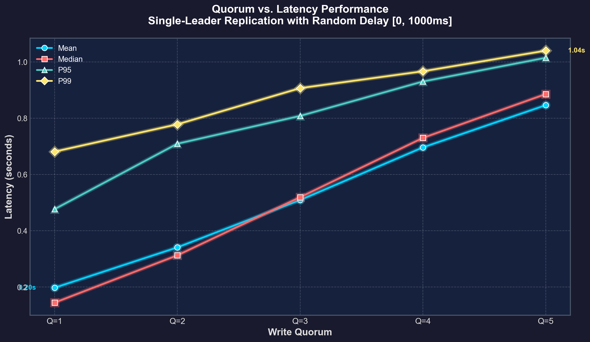

# Laboratory Work 4: Single-Leader Replication Key-Value Store

**Course:** Computer Networking  
**Topic:** Distributed Systems - Leaders and Followers  
**Reference:** Chapter 5, Section 1 "Leaders and Followers" from "Designing Data-Intensive Applications" by Martin Kleppmann

---

## 1. Introduction

This laboratory work implements a distributed key-value store using the **single-leader replication** pattern. The system consists of one leader node and five follower nodes, each running in separate Docker containers. The leader accepts all write requests and replicates them to followers using **semi-synchronous replication**.

### Objectives

- Implement single-leader replication with configurable write quorum
- Handle concurrent requests on both leader and followers
- Simulate network latency to observe real-world replication behavior
- Analyze the trade-off between write quorum and latency
- Verify data consistency across all replicas

---

## 2. System Architecture

### 2.1 Overview

```
                    ┌─────────────────────────────────────────────────────┐
                    │                    CLIENTS                          │
                    └─────────────────────┬───────────────────────────────┘
                                          │
                                          │ PUT /kv/{key}
                                          ▼
                    ┌─────────────────────────────────────────────────────┐
                    │                     LEADER                          │
                    │                                                     │
                    │  • Accepts writes from clients                      │
                    │  • Stores data locally                              │
                    │  • Replicates to followers (semi-synchronous)       │
                    │  • Returns after write_quorum ACKs received         │
                    └─────────────────────┬───────────────────────────────┘
                                          │
                    PUT /internal/replicate/{key} (with random delay)
                                          │
          ┌───────────┬───────────┬───────┴───────┬───────────┬───────────┐
          ▼           ▼           ▼               ▼           ▼           ▼
    ┌──────────┐ ┌──────────┐ ┌──────────┐ ┌──────────┐ ┌──────────┐
    │Follower 1│ │Follower 2│ │Follower 3│ │Follower 4│ │Follower 5│
    │          │ │          │ │          │ │          │ │          │
    │ Stores   │ │ Stores   │ │ Stores   │ │ Stores   │ │ Stores   │
    │ replica  │ │ replica  │ │ replica  │ │ replica  │ │ replica  │
    └──────────┘ └──────────┘ └──────────┘ └──────────┘ └──────────┘
```

### 2.2 Components

| Component | Description |
|-----------|-------------|
| **Leader** | Single node that accepts all write operations |
| **Followers** | 5 nodes that receive replicated data from the leader |
| **Write Quorum** | Minimum number of followers that must acknowledge a write |
| **Network Delay** | Simulated latency [0-1000ms] before each replication request |

### 2.3 Docker Compose Configuration

All services are configured through environment variables in `docker-compose.yml`:

```yaml
services:
  leader:
    environment:
      ROLE: "leader"
      WRITE_QUORUM: "3"
      MIN_DELAY_MS: "0"
      MAX_DELAY_MS: "1000"
      FOLLOWERS: "kv-f1:8000,kv-f2:8000,kv-f3:8000,kv-f4:8000,kv-f5:8000"

  f1:
    environment:
      ROLE: "follower"
      LEADER_URL: "http://leader:8000"
  # ... f2, f3, f4, f5 similarly configured
```

---

## 3. Implementation Details

### 3.1 Technology Stack

- **Python 3.11** - Programming language
- **FastAPI** - Async web framework for REST API
- **httpx** - Async HTTP client for replication
- **asyncio** - Concurrent request handling
- **Docker Compose** - Container orchestration

### 3.2 API Endpoints

| Endpoint | Method | Description | Available On |
|----------|--------|-------------|--------------|
| `/health` | GET | Health check | Leader & Followers |
| `/kv/{key}` | GET | Read a value | Leader & Followers |
| `/kv/{key}` | PUT | Write a value | Leader only |
| `/internal/replicate/{key}` | PUT | Receive replicated data | Followers only |
| `/admin/quorum/{value}` | PUT | Change write quorum | Leader only |

### 3.3 Semi-Synchronous Replication

The leader uses semi-synchronous replication, which means:

1. **All replications start concurrently** - The leader sends replication requests to all 5 followers at the same time
2. **Returns after quorum** - The leader returns success to the client once `write_quorum` followers acknowledge
3. **Background completion** - Remaining replications continue in the background

```python
# Simplified replication logic
tasks = [replicate_to_follower(f) for f in followers]  # Start all

for task in asyncio.as_completed(tasks):
    if await task:
        acks += 1
    if acks >= write_quorum:
        return True  # Return immediately, others continue in background
```

#### Example: Quorum = 3

```
Client: "Save key=hello, value=world"

Leader: "OK, I'll replicate to followers..."
        → Sends to Follower1 (delay: 800ms)
        → Sends to Follower2 (delay: 200ms) ✓ ACK #1
        → Sends to Follower3 (delay: 500ms)
        → Sends to Follower4 (delay: 900ms)
        → Sends to Follower5 (delay: 100ms) ✓ ACK #2
        ...waiting...
        → Follower3 responds ✓ ACK #3

Leader: "Got 3 ACKs! Responding to client..."
Client: Receives "OK" after ~500ms (3rd fastest follower)

Meanwhile: Followers 1 & 4 still receiving data in background
```

#### Synchronous vs Asynchronous Followers

With quorum = 3, the followers dynamically become sync or async based on response time:

| Follower | Delay | Role | Why? |
|----------|-------|------|------|
| F5 | 100ms | **SYNC** | Leader waited for this response |
| F2 | 200ms | **SYNC** | Leader waited for this response |
| F3 | 500ms | **SYNC** | Leader waited for this response (quorum reached!) |
| F1 | 800ms | **ASYNC** | Completed in background after leader returned |
| F4 | 900ms | **ASYNC** | Completed in background after leader returned |

**The 3 fastest became synchronous. The 2 slowest became asynchronous.**

#### Timeline Visualization

```
0ms     100ms    200ms    500ms    800ms    900ms
│        │        │        │        │        │
├────────┴────────┴────────┤        │        │
│   SYNCHRONOUS PHASE      │        │        │
│   (Leader is waiting)    │        │        │
│                          │        │        │
│   F5 ✓   F2 ✓    F3 ✓   │        │        │
│                          │        │        │
│   QUORUM REACHED!        │        │        │
│   Leader returns to      │        │        │
│   client HERE ──────────►│        │        │
│                          │        │        │
│                          ├────────┴────────┤
│                          │ ASYNCHRONOUS    │
│                          │ PHASE           │
│                          │ (Background)    │
│                          │                 │
│                          │ F1 ✓     F4 ✓  │
│                          │                 │
│                          │ Nobody waiting! │
└──────────────────────────┴─────────────────┘
```

### 3.4 Data Versioning

To handle out-of-order message delivery (due to random network delays), each key-value pair includes a version number:

```python
@dataclass
class VersionedValue:
    value: str
    version: int  # Monotonically increasing
```

Followers only accept updates with a higher version number than their current data, preventing race conditions.

#### Why Versioning is Necessary

```
            LEADER                           FOLLOWER
              │                                  │
   Write A    │──── Send A (delay: 500ms) ──────►│
   (v=1)      │                                  │
              │                                  │
   Write B    │──── Send B (delay: 100ms) ──────►│
   (v=2)      │                                  │
              │                                  │
              │                          Receives B first! (v=2)
              │                          Receives A second! (v=1)
              │                                  │
              │                          WITHOUT versioning:
              │                            Apply B → value = "B"
              │                            Apply A → value = "A"  ← WRONG!
              │                                  │
              │                          WITH versioning:
              │                            Apply B (v=2) → value = "B"
              │                            Reject A (v=1 < v=2) → SKIPPED!
              │                            Final value = "B" ← CORRECT!
```

### 3.5 Concurrent Request Handling

FastAPI uses Python's asyncio for concurrent request handling:

```
┌───────────────────────────────────────────────────────────────┐
│                     FASTAPI (async)                           │
│                                                               │
│    Single Thread with Event Loop (asyncio)                    │
│                                                               │
│    ┌──────────────────────────────────────────────────────┐   │
│    │               EVENT LOOP                             │   │
│    │                                                      │   │
│    │   Request 1 ──┐                                      │   │
│    │               │   ┌─────────┐   ┌─────────┐          │   │
│    │   Request 2 ──┼──►│  Task   │   │  Task   │          │   │
│    │               │   │ waiting │   │ running │          │   │
│    │   Request 3 ──┘   │  (I/O)  │   │  (CPU)  │          │   │
│    │                   └─────────┘   └─────────┘          │   │
│    │                                                      │   │
│    │   When Task A waits for network → Task B runs!       │   │
│    └──────────────────────────────────────────────────────┘   │
└───────────────────────────────────────────────────────────────┘
```

This allows handling multiple concurrent requests efficiently without threads.

---

## 4. Performance Experiment

### 4.1 Experiment Setup

| Parameter | Value |
|-----------|-------|
| Total writes | 100 |
| Concurrent writes per batch | 10 |
| Number of batches | 10 |
| Number of keys | 10 |
| Network delay range | [0ms, 1000ms] |
| Write quorum values tested | 1, 2, 3, 4, 5 |

### 4.2 Methodology

1. For each quorum value (1 to 5):
   - Set the write quorum via admin API
   - Execute 100 writes (10 batches × 10 concurrent writes)
   - Measure latency for each write
   - Wait 2 seconds for background replications
   - Verify consistency across all replicas

---

## 5. Results and Analysis

### 5.1 Latency Results

| Quorum | Mean (ms) | Median (ms) | P95 (ms) | P99 (ms) | Consistency |
|--------|-----------|-------------|----------|----------|-------------|
| 1 | 285.9 | 257.4 | 529.0 | 681.1 | 100.0% |
| 2 | 398.6 | 386.4 | 757.4 | 849.2 | 100.0% |
| 3 | 571.4 | 575.4 | 880.2 | 959.5 | 100.0% |
| 4 | 687.5 | 727.9 | 965.0 | 990.2 | 100.0% |
| 5 | 927.7 | 981.5 | 1065.2 | 1085.3 | 100.0% |

### 5.2 Latency vs. Quorum Chart



### 5.3 Analysis of Results

**Why does latency increase with higher quorum?**

The relationship between quorum and latency is explained by **order statistics**:

- **Quorum = 1**: Wait for the **fastest** follower → ~100-300ms
- **Quorum = 3**: Wait for the **3rd fastest** follower → ~500-600ms
- **Quorum = 5**: Wait for the **slowest** follower → ~900-1000ms

With random delays uniformly distributed in [0, 1000ms]:

```
Q=1: Expected latency ≈ min(5 random values) ≈ 167ms
Q=3: Expected latency ≈ median of 5 random values ≈ 500ms
Q=5: Expected latency ≈ max(5 random values) ≈ 833ms
```

**Trade-off:**

```
        LATENCY                           DURABILITY
           ▲                                  ▲
           │                                  │
     High  │ ████████████████  Q=5            │            ████  Q=5
           │ █████████         Q=3            │       ████████  Q=3  
           │ ███               Q=1            │  ████████████  Q=1
     Low   │                                  │
           └─────────────────────►            └─────────────────────►
                                               (inverse relationship)
```

| Quorum | Wait For | Latency | Durability | Risk |
|--------|----------|---------|------------|------|
| **1** | Fastest 1 of 5 | ~100ms | Low | 1 node fails = data loss possible |
| **2** | Fastest 2 of 5 | ~150ms | Medium-Low | Need 2 surviving nodes |
| **3** | Fastest 3 of 5 | ~300ms | Medium | Majority has data |
| **4** | Fastest 4 of 5 | ~600ms | High | Only 1 slow node can lag |
| **5** | ALL 5 | ~900ms | Maximum | All followers have data immediately |

**Key takeaways:**
- Quorum is a dial between speed ↔ safety
- Lower quorum = faster response, but risk of data loss if nodes fail
- Higher quorum = slower response, but data is definitely replicated
- Semi-synchronous means: return after quorum, but keep replicating in background
- Eventual consistency: All followers will get the data... eventually!

---

## 6. Consistency Verification

### 6.1 Methodology

After completing all writes, the system verifies consistency by:

```
┌─────────────────────────────────────────────────────────────┐
│  STEP 1: Read all 10 keys from LEADER                       │
│                                                             │
│  Leader has:                                                │
│    exp-k0 = "q-batch9-v0"                                   │
│    exp-k1 = "q-batch9-v1"                                   │
│    ...                                                      │
│    exp-k9 = "q-batch9-v9"                                   │
└─────────────────────────────────────────────────────────────┘
                          │
                          ▼
┌─────────────────────────────────────────────────────────────┐
│  STEP 2: For EACH follower, read the same 10 keys           │
│                                                             │
│  Follower F1 has:                                           │
│    exp-k0 = "q-batch9-v0" ✓ matches leader                  │
│    exp-k1 = "q-batch9-v1" ✓ matches leader                  │
│    ...all match...                                          │
│  → F1 is CONSISTENT                                         │
└─────────────────────────────────────────────────────────────┘
                          │
                          ▼
┌─────────────────────────────────────────────────────────────┐
│  STEP 3: Calculate consistency percentage                   │
│                                                             │
│  Total comparisons = 10 keys × 5 followers = 50             │
│  Matching pairs = 50                                        │
│  Consistency = (50 / 50) × 100% = 100%                      │
└─────────────────────────────────────────────────────────────┘
```

### 6.2 Final Database State

After 100 writes (10 batches × 10 keys), each node has 10 keys:

```
┌─────────────┬─────────────────┬─────────┐
│ Key         │ Final Value     │ Version │
├─────────────┼─────────────────┼─────────┤
│ exp-k0      │ q-batch9-v0     │ 10      │
│ exp-k1      │ q-batch9-v1     │ 10      │
│ exp-k2      │ q-batch9-v2     │ 10      │
│ exp-k3      │ q-batch9-v3     │ 10      │
│ exp-k4      │ q-batch9-v4     │ 10      │
│ exp-k5      │ q-batch9-v5     │ 10      │
│ exp-k6      │ q-batch9-v6     │ 10      │
│ exp-k7      │ q-batch9-v7     │ 10      │
│ exp-k8      │ q-batch9-v8     │ 10      │
│ exp-k9      │ q-batch9-v9     │ 10      │
└─────────────┴─────────────────┴─────────┘
```

### 6.3 The 2-Second Wait

Before checking consistency, the test waits 2 seconds:

```python
# Wait for background replications to complete before checking
await asyncio.sleep(2)
```

**Why is this critical?**
- With semi-synchronous replication and quorum < 5, some followers receive data in background
- If we check consistency immediately, slow followers might not have data yet
- Waiting 2 seconds allows background replications to finish

### 6.4 Results

```
                     After 100 writes + 2 second wait
                     
    ┌─────────────┐
    │   LEADER    │  exp-k0 = "q-batch9-v0"
    │             │  exp-k1 = "q-batch9-v1"
    │             │  ...
    └─────────────┘
           │
           │ compare
           ▼
    ┌─────────────┐ ┌─────────────┐ ┌─────────────┐ ┌─────────────┐ ┌─────────────┐
    │     F1      │ │     F2      │ │     F3      │ │     F4      │ │     F5      │
    │  same? ✓   │ │  same? ✓    │ │  same? ✓    │ │  same? ✓    │ │  same? ✓    │
    └─────────────┘ └─────────────┘ └─────────────┘ └─────────────┘ └─────────────┘
    
    All 5 match leader → CONSISTENCY = 100%
```

All quorum values achieved **100% consistency** after the 2-second wait period.

### 6.5 Explanation

The 100% consistency is achieved because:

1. **Eventual Consistency**: The 2-second wait allows all background replications to complete
2. **Versioning**: Prevents out-of-order updates from corrupting data
3. **No Failures**: All nodes remained healthy during the experiment

**Important Note**: With semi-synchronous replication (quorum < 5), immediate reads from followers may return stale data. Consistency is **eventual**, not immediate.

---

## 7. Integration Tests

The system includes integration tests to verify:

| Test | Description |
|------|-------------|
| `test_followers_reject_writes` | Followers return 403 for direct write attempts |
| `test_leader_accepts_writes` | Leader successfully processes writes |
| `test_concurrent_writes` | System handles concurrent write requests |
| `test_replication_eventual_consistency` | All replicas eventually have the same data |

### Test Flow for Performance Experiment

```
run_quorum_experiment.py
         │
         ▼
    Runs test_performance.py
         │
         ├── Does 100 writes
         ├── Waits 2 seconds
         ├── Calls verify_consistency()
         │      │
         │      ├── Reads all keys from leader
         │      ├── Reads all keys from each follower
         │      └── Compares them
         │
         └── Reports consistency percentage
```

Run tests with:
```bash
docker exec kv-tests pytest tests/test_integration.py -v
```

---

## 8. Conclusion

This laboratory work successfully implemented a single-leader replication system with the following characteristics:

1. **Single-Leader Architecture**: Only the leader accepts writes, ensuring consistency
2. **Semi-Synchronous Replication**: Configurable write quorum balances latency vs. durability
3. **Concurrent Processing**: Both leader and followers handle requests asynchronously
4. **Network Simulation**: Random delays demonstrate real-world replication challenges
5. **Eventual Consistency**: All replicas converge to the same state

**Key Findings:**

- Higher write quorum increases latency but improves durability
- Versioning is essential for handling out-of-order message delivery
- Semi-synchronous replication provides a good balance between performance and reliability

---

## 9. How to Run

### Start the System
```bash
cd "Laboratory Work 4"
docker-compose up -d --build
```

### Run Integration Tests
```bash
docker exec kv-tests pytest tests/test_integration.py -v
```

### Run Performance Experiment
```bash
docker exec kv-tests python -m tests.run_quorum_experiment
```

### Generate Latency Chart
```bash
python tests/plot_results.py
```

### Stop the System
```bash
docker-compose down
```

---

## 10. References

1. Kleppmann, M. (2017). *Designing Data-Intensive Applications*. O'Reilly Media. Chapter 5: Replication.
2. FastAPI Documentation: https://fastapi.tiangolo.com/
3. Docker Compose Documentation: https://docs.docker.com/compose/
